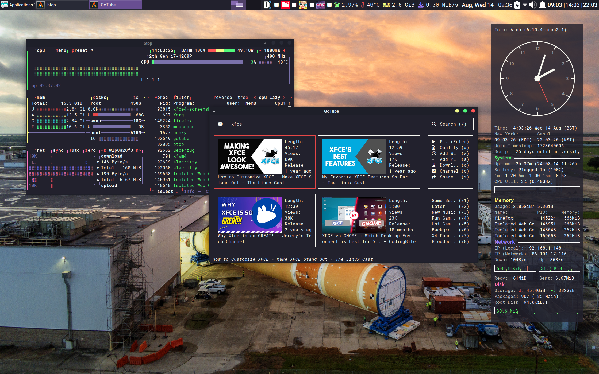

# Xfce 4 WM and DE Config

## Installation

In addition to the regular installation commands, run:  
`./init.sh --install xfce`  
`./setup.sh --make xfce`  

Make sure to run these commands while Xfce is not loaded (e.g. from the Arch console (`Ctrl+Alt+F2`))

## Features

A minimal Xfce-4 setup designed not to get in the way, and use as little screen real estate as possible.

### Panel

Notable features

* System monitors:
	* CPU Usage
	* CPU Temperature
	* RAM Usage
	* Network (Download) Usage
* Time Info:
	* Current Date
	* Time in Multiple Timezones (Shown: New York - London - Seoul)
	* Uptime
* Livestream Monitors

### Keyboard Shortcuts

Features keyboard shortcuts for commonly used applications as well as window manage functions such as window snapping

See [Xfce/Xfwm Keyboard Shortcuts](https://randomcoder67.github.io/dotfiles/xfce4keyboard.html) for more details
